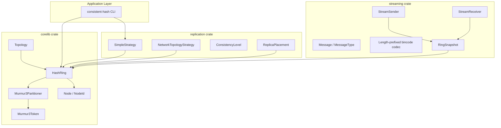

# consistent-hash-rs

A Rust workspace for **consistent hashing** — the same family of algorithms used by distributed databases and caches (Cassandra, DynamoDB, memcached, Redis Cluster) to map keys to nodes with minimal disruption when the cluster changes size.

This project provides a production-oriented core library, replication strategies, ring-state streaming, and a CLI for inspection and benchmarking.

---

## Table of Contents

- [Why Consistent Hashing?](#why-consistent-hashing)
- [Architecture](#architecture)
- [Crates](#crates)
- [Core Concepts](#core-concepts)
- [Quick Start](#quick-start)
- [API Overview](#api-overview)
- [Replication](#replication)
- [Streaming Protocol](#streaming-protocol)
- [CLI Reference](#cli-reference)
- [Performance Characteristics](#performance-characteristics)
- [Testing](#testing)
- [Roadmap](#roadmap)
- [License](#license)

---

## Why Consistent Hashing?

When you shard data across N servers, a naive `hash(key) % N` breaks whenever N changes: almost every key moves. Consistent hashing places both **keys** and **nodes** on a logical ring. A key is owned by the first node encountered when walking **clockwise** from the key's position.

Benefits:

| Property | Benefit |
|----------|---------|
| **Minimal remapping** | Only keys between the departing/arriving node and its neighbor move |
| **Load smoothing** | Virtual nodes (vnodes) spread ownership more evenly |
| **Replication** | Walk clockwise to find additional replica nodes |
| **Topology awareness** | Prefer replicas in different racks / data centers |

---

## Architecture



### Ring lookup flow

```text
Key "user:42"
    │
    ▼
Murmur3Partitioner.partition(key)  →  Token T
    │
    ▼
BTreeMap.range(T..)                →  first token ≥ T (clockwise)
    │
    ▼
Token → NodeId mapping             →  owning node
```

If no token exists at or after `T`, the search **wraps** to the smallest token on the ring.

---

## Crates

| Crate | Purpose |
|-------|---------|
| **`corelib`** | Hash ring, tokens, partitioners, nodes, virtual nodes, topology views |
| **`replication`** | Pluggable replication strategies, consistency levels, replica placement |
| **`streaming`** | Wire protocol, codec, ring snapshots, sender/receiver for bootstrap & sync |
| **`cli`** | Command-line tool for describe, lookup, benchmark, and cluster demos |

Workspace root: `Cargo.toml` with shared dependencies (`serde`, `tokio`, `parking_lot`, etc.).

---

## Core Concepts

### Tokens

A **token** is a position on the ring. The default implementation is `Murmur3Token` (`u64`), compatible with Cassandra-style partitioning.

```rust
use corelib::token::murmur3::Murmur3Token;

let token = Murmur3Token::from_key("my-key");
```

### Partitioners

A **partitioner** converts arbitrary keys into tokens. `Murmur3Partitioner` is the default and is wired into `HashRing`.

Additional partitioner stubs exist for future use: `RandomPartitioner`, `ByteOrderedPartitioner`.

### Nodes and Virtual Nodes

- **`NodeId`**: compact `u128` identifier
- **`Node`**: metadata (name, optional datacenter, optional rack)
- **Virtual nodes**: each physical node is placed on the ring multiple times (default **256**) using keys `"<node_id>:<index>"` hashed to tokens

More vnodes → smoother distribution; fewer keys move per node join/leave.

### HashRing

Thread-safe ring backed by:

- `BTreeMap<Murmur3Token, NodeId>` — O(log n) clockwise lookup
- `HashMap<NodeId, Node>` — O(1) node metadata
- `parking_lot::RwLock` — concurrent reads, exclusive writes

```rust
use corelib::{Node, NodeId};
use corelib::ring::HashRing;

let ring = HashRing::new();
ring.add_node(Node::new(NodeId(1), "node-1"), 256);

let owner = ring.lookup(b"user:42");
let replicas = ring.replicas_for_key(b"user:42", 3);
```

### RingBuilder

Fluent API for constructing rings:

```rust
use corelib::ring::RingBuilder;
use corelib::{Node, NodeId};

let ring = RingBuilder::new()
    .with_vnodes(512)
    .add_node(Node::new(NodeId(1), "a"))
    .add_node(Node::new(NodeId(2), "b"))
    .build();
```

### Topology

`Topology` is a read-only analytical view over a `HashRing`:

- `ownership()` — tokens grouped by node
- `ownership_percentages()` — load distribution
- `describe()` — human-readable ring report
- `replicas_for_key()` — clockwise replica walk

---

## Quick Start

### Prerequisites

- Rust 1.70+ (edition 2021)
- Cargo

### Build and test

```bash
git clone <your-repo-url>
cd consistent-hash-rs
cargo build
cargo test
```

All **29 unit tests** and integration tests should pass across the four crates.

### Run the CLI

```bash
cargo run -p cli -- describe --nodes 5 --vnodes 256
cargo run -p cli -- lookup my-key --nodes 5 --replicas 3
cargo run -p cli -- benchmark --nodes 10 --iterations 100000
```

Binary name: `consistent-hash` (defined in `crates/cli/Cargo.toml`).

---

## API Overview

### corelib public exports

| Type / Module | Description |
|---------------|-------------|
| `HashRing` / `Ring` | Main ring type |
| `RingBuilder` | Builder pattern for ring construction |
| `Topology` | Ownership analysis and description |
| `Node`, `NodeId` | Cluster participants |
| `VirtualNode` | Single token position owned by a node |
| `Partitioner` | Key → token trait |
| `Token` | Ring position trait |
| `Error`, `Result` | Error handling |

### Key `HashRing` methods

| Method | Complexity | Description |
|--------|------------|-------------|
| `lookup(key)` | O(log n) | Find owning `NodeId` |
| `lookup_node(key)` | O(log n) | Find full `Node` metadata |
| `replicas_for_key(key, r)` | O(r · log n) | Clockwise replica set |
| `add_node(node, vnodes)` | O(v · log n) | Add node with v virtual tokens |
| `remove_node(id)` | O(n) | Remove node and all its tokens |
| `tokens()` | O(n) | Snapshot all (token, node) pairs |

---

## Replication

The `replication` crate provides strategy traits and helpers on top of `HashRing`.

### SimpleStrategy

Places **N replicas** sequentially clockwise from the primary node. Best for single-datacenter clusters.

```rust
use replication::SimpleStrategy;
use replication::ReplicationStrategy;

let strategy = SimpleStrategy::new(3);
let replicas = strategy.replicas_for_key(&ring, b"my-key");
```

### NetworkTopologyStrategy

Spreads replicas across **data centers** and **racks** when node metadata is set:

```rust
use corelib::Node;
use replication::NetworkTopologyStrategy;

ring.add_node(
    Node::with_topology(NodeId(1), "n1", "us-east", "rack-a"),
    256,
);
```

### ConsistencyLevel

Cassandra-inspired read/write quorum semantics:

| Level | Required acks (RF=3) |
|-------|----------------------|
| `One` | 1 |
| `Two` | 2 |
| `Quorum` | 2 |
| `All` | 3 |
| `LocalQuorum` | majority in local DC |
| `LocalOne` | 1 in local DC |

### ReplicaPlacement

```rust
use replication::ReplicaPlacement;

let placement = ReplicaPlacement::for_key(&ring, b"key", 3).unwrap();
assert_eq!(placement.primary, placement.replicas[0]);
```

---

## Streaming Protocol

The `streaming` crate synchronizes ring state between nodes (bootstrap, incremental updates, migration).

### Message types

| `MessageType` | Purpose |
|---------------|---------|
| `RingSnapshot` | Full ring state for bootstrap |
| `NodeAdded` | Incremental join |
| `NodeRemoved` | Incremental leave |
| `DataChunk` | Key range migration payload |
| `Heartbeat` | Liveness |
| `Ack` | Acknowledgement |

### Framing

Messages are **length-prefixed** (4-byte big-endian) **bincode** frames. Max frame size: 16 MiB.

### Ring snapshots

```rust
use streaming::{StreamSender, StreamReceiver, RingSnapshot};
use corelib::{NodeId, ring::HashRing};

let ring = HashRing::new();
// ... populate ring ...

let snapshot = RingSnapshot::from_ring(&ring, &[(NodeId(1), 256)]);
let bytes = snapshot.to_bytes()?;
let restored = RingSnapshot::from_bytes(&bytes)?;
let rebuilt_ring = restored.build_ring()?;
```

### In-memory channels

```rust
let (mut sender, rx) = StreamSender::channel(64);
let mut receiver = StreamReceiver::from_channel(rx);

sender.send_snapshot(&ring, &vnode_counts).await?;
let msg = receiver.recv().await?.unwrap();
let ring = StreamReceiver::apply_snapshot(&msg)?;
```

TCP helpers: `codec::read_message`, `codec::write_message`, and `FrameDecoder` for buffered reads.

---

## CLI Reference

| Command | Description |
|---------|-------------|
| `describe` | Print ring topology and ownership percentages |
| `lookup <key>` | Resolve primary owner and replica set |
| `benchmark` | Measure lookup throughput and latency |
| `add-node <name>` | Add a node to a demo ring |
| `remove-node <id>` | Remove a node from a demo ring |

### Examples

```bash
# Describe a 3-node ring with 256 vnodes each
consistent-hash describe -n 3 -v 256

# Look up key ownership and replicas
consistent-hash lookup "session:abc123" -n 5 -r 3

# Benchmark 100k lookups on a 10-node ring
consistent-hash benchmark -n 10 -i 100000

# Add a node with custom vnodes
consistent-hash add-node cache-4 --id 4 -v 512
```

---

## Performance Characteristics

| Operation | Time | Notes |
|-----------|------|-------|
| Lookup | O(log n) | n = total vnodes; concurrent reads |
| Add node | O(v · log n) | v = vnodes for that node |
| Remove node | O(n) | Scans all tokens; rare operation |
| Replica walk | O(r · log n) | r = replica count |
| Clone `HashRing` | O(1) | `Arc` shallow clone |

**Defaults**

- Vnodes per node: **256** (`RingBuilder`)
- Partitioner: **Murmur3Partitioner**
- Replication factor (strategy default): **3**

**Tuning guidance**

- Increase vnodes when ownership skew is visible in `Topology::ownership_percentages()`
- Use `NetworkTopologyStrategy` for multi-DC deployments
- Avoid calling `tokens()` on hot paths — it allocates O(n)

---

## Testing

```bash
# All crates
cargo test

# Individual crates
cargo test -p corelib
cargo test -p replication
cargo test -p streaming
cargo test -p cli

# Ring integration tests
cargo test -p corelib --test ring_test
```

### Test coverage highlights

| Area | Tests |
|------|-------|
| Ring basics | empty lookup, add/remove, idempotency |
| Builder | default/custom/mixed vnodes |
| Topology | ownership, percentages, describe |
| Replication | simple + network topology strategies, quorum math |
| Streaming | codec roundtrip, snapshot rebuild, channel flow |

---

## Project Layout

```text
consistent-hash-rs/
├── Cargo.toml              # Workspace manifest
├── overview.md             # This document
└── crates/
    ├── corelib/            # Hash ring core
    │   ├── src/
    │   │   ├── ring/       # HashRing, RingBuilder, position
    │   │   ├── token/      # Murmur3, byte-ordered, random tokens
    │   │   ├── partitioner/
    │   │   ├── topology.rs
    │   │   ├── node.rs
    │   │   └── vnode.rs
    │   └── tests/ring_test.rs
    ├── replication/        # Strategies & consistency
    ├── streaming/          # Protocol & snapshots
    └── cli/                # CLI binary
```

---

## Roadmap

Planned or stubbed modules ready for extension:

| Module | Status |
|--------|--------|
| `corelib::network` | Stub — transport-agnostic RPC traits |
| `corelib::config` | Stub — shared configuration loading |
| `corelib::ring::topology::RingTopology` | Stub — ownership ranges |
| QUIC transport (`quinn`) | Dependency removed from streaming; TCP codec ready |
| `RandomPartitioner` / `ByteOrderedPartitioner` | Implemented as alternatives, not default |

Contributions welcome for: persistent ring storage, gossip membership, range migration orchestration, and production QUIC/TLS streaming.

---

## License

MIT OR Apache-2.0 — see workspace `Cargo.toml` for details.

---

## Summary

**consistent-hash-rs** is a modular, well-tested consistent hashing toolkit for Rust:

1. **`corelib`** — fast, thread-safe `HashRing` with Murmur3 tokens and vnode support
2. **`replication`** — simple and topology-aware replica placement with quorum levels
3. **`streaming`** — snapshot-based ring sync with a framed binary protocol
4. **`cli`** — inspect, lookup, and benchmark rings from the terminal

Build it, test it, and embed `HashRing` directly in your distributed cache, database proxy, or load balancer control plane.
